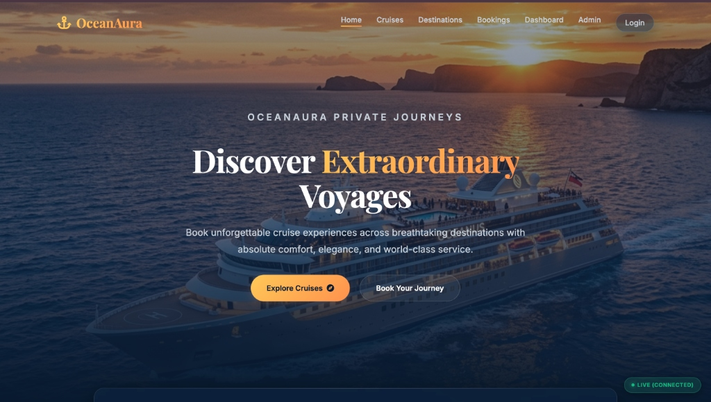
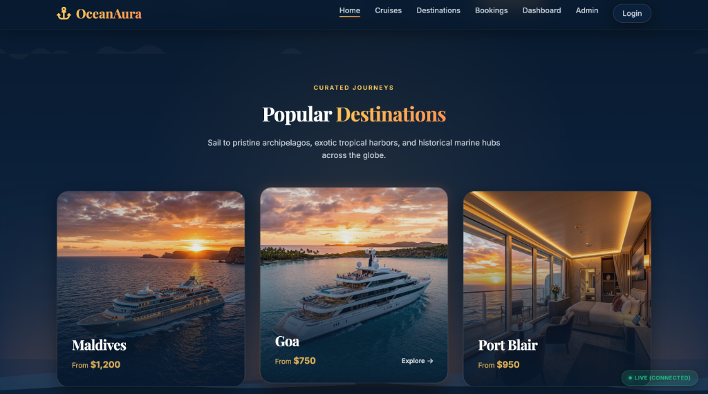
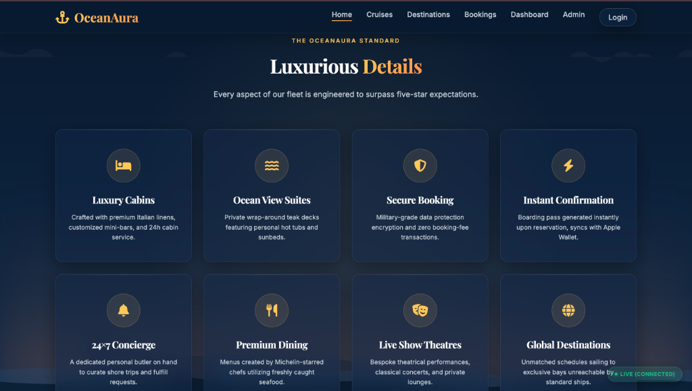
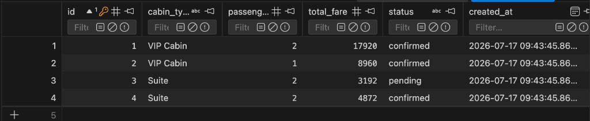
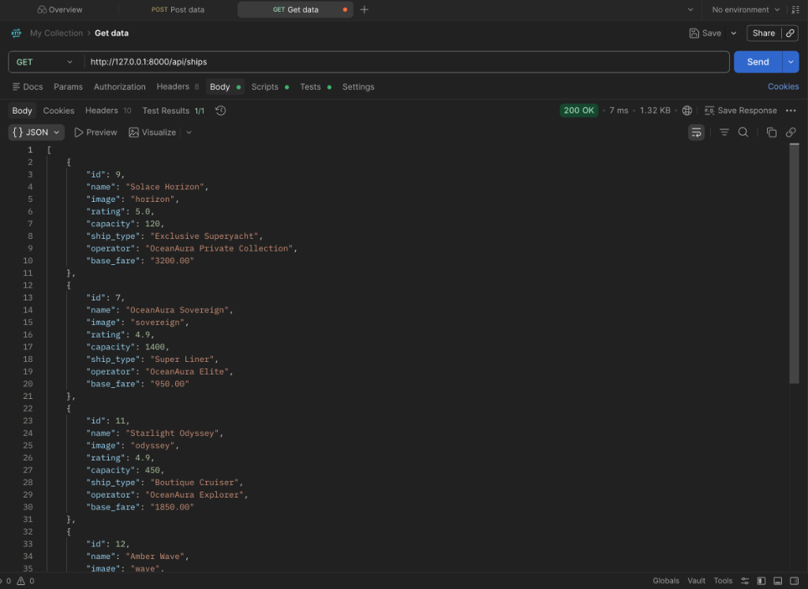
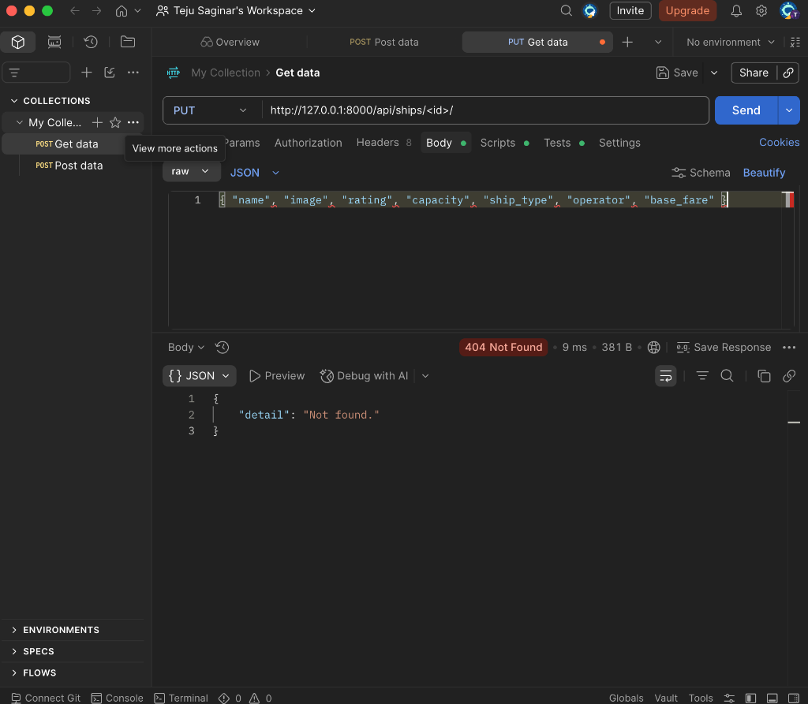

# 🌅 OceanAura Ship Booking Platform

OceanAura is an ultra-premium, Apple-level Ship Booking Platform featuring a cinematic luxury cruise aesthetic. The design is inspired by sunset cruises during golden hour: deep navy waters, glowing amber accents, glassmorphic panels, and elegant yachts.

---

## 📷 Visual Showcase

### Cinematic Hero Landing


### Popular Destinations Grid


### The OceanAura Standard & Details


### SQLite Database & Seed Manifest Ledger (`db.sqlite3`)


### REST API Response (JSON representation of active ships database)


---

## ✨ Features

1. **Dual-Mode API Wrapper (`api.js`)**:
   - Automatically detects Django REST server status on port 8000.
   - Falls back to a fully responsive, LocalStorage-backed client database if offline, enabling seamless client-side CRUD testing.
2. **Dynamic Client Router (`router.js`)**:
   - Hash-based Single Page App (SPA) controller.
   - Executes smooth slide-and-fade route transition triggers without browser page reloads.
3. **Manifest Checkout & Secure Payments (`app.js`)**:
   - Custom stateroom multiplier calculations and luxury port taxes (12%).
   - Tabbed checkout gate (UPI QR, Credit/Debit card validation) with full-screen confetti success screens.
   - Printable luxury boarding pass modal complete with gate check-in QR codes.
4. **Passenger Analytics Dashboard**:
   - Summary metric cards for reservations, journeys, and expenditures.
   - Animated CSS chart engines plotting passenger spending history.
5. **Admin Control Panel**:
   - Full CRUD database editor interface for `Ships`, `Passengers`, `Routes`, `Schedules`, `Bookings`, and `Payments`.
   - Dynamic popup modal forms to commit updates or decommission vessels.

---

## 📂 Project Architecture

```
project2/
├── backend/                   # Django REST Backend
│   ├── backend/               # Project Configuration
│   │   ├── settings.py        # CORS config, DRF, & api app registry
│   │   └── urls.py            # API routing mount
│   ├── api/                   # REST API App
│   │   ├── models.py          # Database schemas (Ship, Booking, Passenger, etc.)
│   │   ├── serializers.py     # Nested DRF serializations
│   │   ├── views.py           # ModelViewSets for CRUD endpoints
│   │   └── management/
│   │       └── commands/
│   │           └── seed.py    # Database seeder script
│   ├── db.sqlite3             # Relational SQLite DB file
│   └── requirements.txt       # Backend dependencies
├── frontend/                  # Vanilla Web Frontend
│   ├── index.html             # HTML Shell & Animated ocean wave backdrop
│   ├── css/
│   │   └── style.css          # Theme styles, glassmorphism, & animation rules
│   ├── js/
│   │   ├── router.js          # SPA Client Hash Router
│   │   ├── api.js             # API wrapper & LocalStorage DB
│   │   └── app.js             # Page rendering modules & dashboard graphs
│   └── assets/                # Ship image PNGs & sunset graphics
└── docs/
    └── screenshots/           # Documentation images
```

---

## 🚀 Running the Platform

### 1. Setup Backend (Django REST API)
Open a terminal in the project directory and initialize the virtual environment:
```bash
# Create Virtual Environment
python3 -m venv venv

# Activate Virtual Environment (macOS/Linux)
source venv/bin/activate

# Install Dependencies
pip install -r backend/requirements.txt

# Create and apply migrations
python backend/manage.py makemigrations
python backend/manage.py migrate

# Seed database with sample passengers, ships, and bookings
python backend/manage.py seed

# Start server
python backend/manage.py runserver
```
The server will boot on port `8000`. Direct API links can be inspected at:
* **Ships API**: [http://127.0.0.1:8000/api/ships/](http://127.0.0.1:8000/api/ships/)
* **Bookings API**: [http://127.0.0.1:8000/api/bookings/](http://127.0.0.1:8000/api/bookings/)

### 2. Launch Frontend
Double-click and open the static frontend launchpad in your browser:
* **Homepage**: [frontend/index.html](file:///Users/venkat/Desktop/project2/frontend/index.html)

*Note: The platform is configured with CORS. A glowing **Live (Connected)** badge will display in the bottom-right corner when the server is active, indicating direct SQLite integrations.*

---

## 🌐 REST API Endpoints Reference

The Django REST API runs via a `DefaultRouter` offering a standard RESTful architecture. The base URL is `http://127.0.0.1:8000/api/`.

| Resource | HTTP Method | Endpoint URL | Purpose / Action | Payload / Query |
| :--- | :--- | :--- | :--- | :--- |
| **Ships** | `GET` | `/api/ships/` | List all luxury ship profiles | *None* |
| | `GET` | `/api/ships/<id>/` | Get detailed stats for one vessel | *None* |
| | `POST` | `/api/ships/` | Commission a new ship | `{ name, image, rating, capacity, ship_type, operator, base_fare }` |
| | `PUT` | `/api/ships/<id>/` | Replace all ship parameters | `{ name, image, rating, capacity, ship_type, operator, base_fare }` |
| | `PATCH` | `/api/ships/<id>/` | Modify specific parameters | `{ rating: 4.9, base_fare: "1100.00" }` |
| | `DELETE` | `/api/ships/<id>/` | Decommission / delete vessel | *None* |
| **Routes** | `GET` | `/api/routes/` | Retrieve catalog of mapped ports | *None* |
| | `POST` | `/api/routes/` | Set up a new marine route | `{ source_port, destination_port, distance }` |
| | `DELETE` | `/api/routes/<id>/` | Delete a navigation route | *None* |
| **Schedules** | `GET` | `/api/schedules/` | List current voyages (includes nested ship/route) | *None* |
| | `POST` | `/api/schedules/` | Schedule a new voyage | `{ ship_id, route_id, departure_date, return_date }` |
| | `DELETE` | `/api/schedules/<id>/` | De-authorize a sailing schedule | *None* |
| **Passengers** | `GET` | `/api/passengers/` | List passenger database roster | *None* |
| | `POST` | `/api/passengers/` | Register/create a new passenger | `{ name, email, phone, passport_number }` |
| | `DELETE` | `/api/passengers/<id>/` | Remove a passenger manifest profile | *None* |
| **Bookings** | `GET` | `/api/bookings/` | Review booking manifests (includes nested traveler/voyage) | *None* |
| | `POST` | `/api/bookings/` | Reserve a stateroom booking | `{ passenger_id, schedule_id, cabin_type, passenger_count, total_fare }` |
| | `PATCH` | `/api/bookings/<id>/` | Update status (e.g. cancel booking) | `{ status: "cancelled" }` |
| | `DELETE` | `/api/bookings/<id>/` | Purge booking from database | *None* |
| **Payments** | `GET` | `/api/payments/` | List payment transaction logs | *None* |
| | `POST` | `/api/payments/` | Create payment ledger entry | `{ booking_id, amount, payment_method, transaction_id, status }` |

---

## 🛜 Sample API JSON Payloads (POST & PUT)

When making `POST` (create) or `PUT` (replace) requests, make sure your HTTP request headers include:
`Content-Type: application/json`

### 1. Commission a Ship (`POST /api/ships/` or `PUT /api/ships/<id>/`)
*URL Examples*:
* **POST**: `http://127.0.0.1:8000/api/ships/`
* **PUT**: `http://127.0.0.1:8000/api/ships/9/` (Replace `<id>` with the actual integer ID of the ship)

*Payload*:
```json
{
  "name": "OceanAura Sovereign",
  "image": "sovereign",
  "rating": 4.9,
  "capacity": 1400,
  "ship_type": "Super Liner",
  "operator": "OceanAura Elite",
  "base_fare": "950.00"
}
```

### 2. Map a Route (`POST /api/routes/` or `PUT /api/routes/<id>/`)
*Payload*:
```json
{
  "source_port": "Maldives",
  "destination_port": "Goa",
  "distance": 780
}
```

### 3. Schedule a Voyage (`POST /api/schedules/` or `PUT /api/schedules/<id>/`)
*Note: In REST API requests, foreign key references use the integer database IDs of the related Ship and Route.*
*Payload*:
```json
{
  "ship": 3,
  "route": 1,
  "departure_date": "2026-08-20",
  "return_date": "2026-08-27"
}
```

### 4. Create a Passenger Profile (`POST /api/passengers/` or `PUT /api/passengers/<id>/`)
*Payload*:
```json
{
  "name": "Tony Stark",
  "email": "tony@starkindustries.com",
  "phone": "+1 555-0100",
  "passport_number": "US8834928"
}
```

### 5. Create a Booking manifest (`POST /api/bookings/` or `PUT /api/bookings/<id>/`)
*Payload*:
```json
{
  "passenger": 2,
  "schedule": 3,
  "cabin_type": "VIP Cabin",
  "passenger_count": 2,
  "total_fare": "17920.00",
  "status": "confirmed"
}
```

### 6. Create a Payment ledger (`POST /api/payments/` or `PUT /api/payments/<id>/`)
*Payload*:
```json
{
  "booking": 2,
  "amount": "17920.00",
  "payment_method": "Credit Card",
  "transaction_id": "TXN_STARKVIP",
  "status": "success"
}
```

---

## 📸 Postman Testing
When testing `PUT` requests in Postman, ensure you replace `<id>` in the URL query with a valid integer ID (e.g. `9`) to prevent `404 Not Found` errors:




